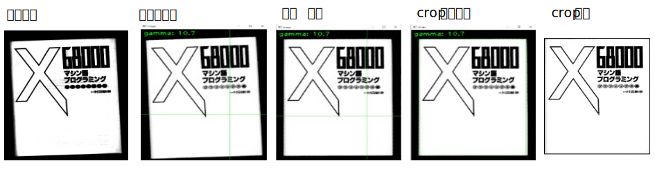

<html lang="ja">
    <head>
        <meta charset="utf-8" />
    </head>
    <body>
        <h1>
Correct Gamma, Tilt and then Crop
</h1>
        <h2>なにものか？</h2>
        

            画像のガンマ補正、傾き補正、切り出しを行います。 
             
        

        <h2>環境構築方法</h2>
        

            pip install opencv-python 
        

        <h2>使い方</h2>
        

            python CorrectGammaTilt_and_then_Crop.py (画像ファイル名) 
             
            結果は corrected_(画像ファイル名).png に保存されます。 
            <table border="1">
                <tr><th>操作</th><th>機能</th></tr>
                <tr><td>+キー押下</td><td>表示を拡大します</td></tr>
                <tr><td>-キー押下</td><td>表示を縮小します</td></tr>
                <tr><td>Gキー押下</td><td>ガンマを上げます</td></tr>
                <tr><td>gキー押下</td><td>ガンマを下げます</td></tr>
                <tr><td>矢印キー押下</td><td>傾きを補正します</td></tr>
                <tr><td>1キー押下</td><td>画像を右回りに90度回転します</td></tr>
                <tr><td>2キー押下</td><td>画像を左回りに90度回転します</td></tr>
                <tr><td>3キー押下</td><td>画像を180度回転します</td></tr>
                <tr><td>左ボタン押下＋ドラッグ</td><td>crop領域を選択します</td></tr>
                <tr><td>スペースキー押下</td><td>crop領域の選択をキャンセルします</td></tr>
                <tr><td>エンターキー押下</td><td>cropした画像を保存します</td></tr>
                <tr><td>sキー押下</td><td>cropせずに補正画像を保存します</td></tr>
                <tr><td>ESCキー押下</td><td>プログラムを終了します</td></tr>
            </table>
        

    </body>
